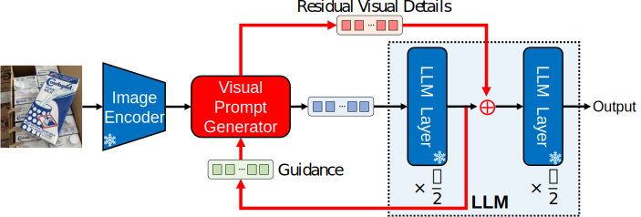
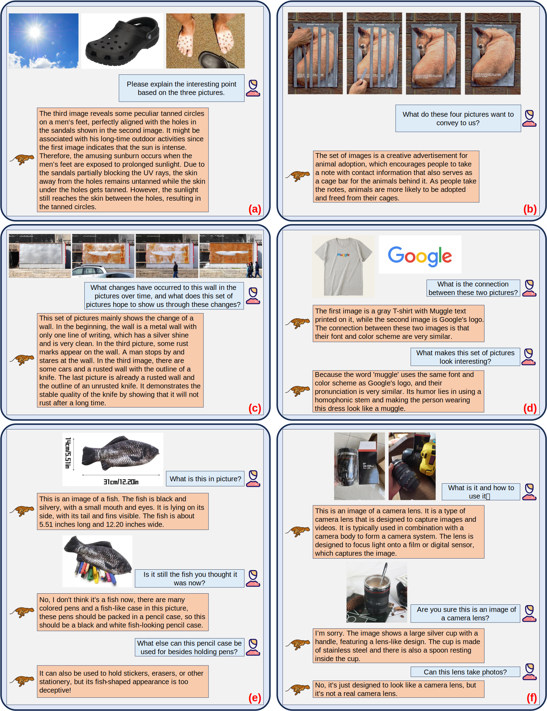

<h1 align = "center">
Fine-tuning Multimodal LLMs to Follow Zero-shot Demonstrative Instructions
</h1>

<div align="center">
Juncheng Li<sup>1,2</sup>*, Kaihang Pan<sup>1</sup>*, Zhiqi Ge<sup>1</sup>*, Minghe Gao<sup>1</sup>*, Wei Ji<sup>2</sup>, Wenqiao Zhang<sup>2&dagger</sup>, 
 
 Tat-Seng Chua<sup>2</sup>, Siliang Tang<sup>1&dagger;</sup>, Hanwang Zhang<sup>3</sup>, Yueting Zhuang<sup>1&dagger;</sup>


<sup>1</sup>Zhejiang University, <sup>2</sup>National University of Singapore, <sup>3</sup>Nanyang Technological University

\*Equal Contribution. <sup>&dagger;</sup>Corresponding Authors

**ICLR 2024, Spotlights (Top 5%)**

<a href='https://arxiv.org/abs/2308.04152'></a> 

<a>English</a> | <a href="README_zh.md">简体中文</a>

</div>

## DEMON Benchmark

To comprehensively benchmark the demonstrative instruction following ability, we extensively gather a wide variety of multi-modal datasets from different fields and scenarios. 

DEMON has three important properties: 

- **Demonstrative vision-language context:** all the instructions contain sequences of inter-related images and texts, such as storyboards with scripts, and textbooks with diagrams.
- **Diverse forms of complex instructions:** the instructions range from designing panels for comics, to discovering differences
between surveillance images, and to conversational embodied tasks. 
- **Vast range of instruction-following scenarios:** the benchmark covers multiple practical scenarios, including cartoons, indus-
trial visuals, driving recordings, recipes, etc.


## Visual Prompt Generator Complete
VPG-C is built upon the frozen LLM and vision encoder. We adopt the widely used Q-Former from BLIP-2 as our visual prompt generator. VPG-C first uses the intermediate output of the LLM to infer instruction-specific guidance. This then assists the VPG in attending the missing visual details from the images. By merging these residual details back via a residual connection, VPG-C  achieves a thorough grasp of the demonstrative instruction.



Empowered by VPG-C, which can effectively handle a wide variety of interleaved vision-language instructions, we develop Cheetah, a Transformer-based multi-modal large language model.

## Cases
Cheetah demonstrates strong abilities to perform reasoning over complicated interleaved vision-language instructions. For instance, in **(a)**, Cheetah is able to keenly identify the connections between the images and thereby infer the reason that causes this unusual phenomenon. In **(b, c)**, Cheetah can reasonably infer the relations among the images and understand the metaphorical implications they want to convey. In **(e, f)**, Cheetah exhibits the ability to comprehend absurd objects through multi-modal conversations with humans.





## Getting Started
**1. Installation**

Git clone our repository and creating conda environment:
```bash
git clone https://github.com/DCDmllm/Cheetah.git
cd Cheetah/Cheetah
conda create -n cheetah python=3.8
conda activate cheetah
pip install -r requirement.txt
```

**2. Prepare Vicuna Weights and Llama2 weights**

The current version of Cheetor supports Vicuna-7B and LLaMA2-7B  as the language model. Please first follow the [instructions](https://huggingface.co/lmsys/vicuna-7b-delta-v0) to prepare Vicuna-v0 7B weights and follow the [instructions](https://huggingface.co/meta-llama/Llama-2-7b-chat-hf) to prepare LLaMA-2-Chat 7B weights. 

Then modify the ```llama_model``` in the [Cheetah/cheetah/configs/models/cheetah_vicuna.yaml](Cheetah/cheetah/configs/models/cheetah_vicuna.yaml#L16) to the folder that contains Vicuna weights and modify the ```llama_model``` in the [Cheetah/cheetah/configs/models/cheetah_llama2.yaml](Cheetah/cheetah/configs/models/cheetah_llama2.yaml#L16) to the folder that contains LLaMA2 weights.


**3. Prepare the pretrained checkpoint for Cheetor**

Download the pretrained checkpoints of Cheetah according to the language model you prepare:
|                                Checkpoint Aligned with Vicuna 7B                                |                               Checkpoint Aligned with LLaMA2 7B                                |
:------------------------------------------------------------------------------------------------:|:----------------------------------------------------------------------------------------------:
 [Download](https://drive.google.com/file/d/1mBiMzyY468QWUix8CuCvuByVEs9yfYPu/view?usp=drive_link) | [Download](https://drive.google.com/file/d/1kzpbvcFdq1XxAGSPbqPMmsjwi-etJ5Yi/view?usp=drive_link) 

For the checkpoint aligned with Vicuna 7B, please set the path to the pretrained checkpoint in the evaluation config file in [Cheetah/eval_configs/cheetah_eval_vicuna.yaml](Cheetah/eval_configs/cheetah_eval_vicuna.yaml#L10) at Line 10.

For the checkpoint aligned with LLaMA2 7B, please set the path to the pretrained checkpoint in the evaluation config file in [Cheetah/eval_configs/cheetah_eval_llama2.yaml](Cheetah/eval_configs/cheetah_eval_llama2.yaml#L10) at Line 10.

Besides, Cheetor reuses the [pretrained Q-former from BLIP-2 that matches FlanT5-XXL](https://storage.googleapis.com/sfr-vision-language-research/LAVIS/models/BLIP2/blip2_pretrained_flant5xxl.pth).

**4. How to use Cheetor**

Examples of using our Cheetah model are provided in files [Cheetah/test_cheetah_vicuna.py](Cheetah/test_cheetah_vicuna.py) and [Cheetah/test_cheetah_llama2.py](Cheetah/test_cheetah_llama2.py). You can test your own samples following the format shown in these two files. And you can run the test code in the following way (taking the Vicuna version of Cheetah as an example):

```
python test_cheetah_vicuna.py --cfg-path eval_configs/cheetah_eval_vicuna.yaml --gpu-id 0
```

And in the near future, we will also demonstrate how to launch the gradio demo of Cheetor locally.

## Citation
If you found this work useful, please consider giving this repository a star and citing our paper as followed:
```
@article{li2023finetuning,
  title={Fine-tuning Multimodal LLMs to Follow Zero-shot Demonstrative Instructions}, 
  author={Li, Juncheng and Pan, Kaihang and Ge, Zhiqi and Gao, Minghe and Zhang, Hanwang and Ji, Wei and Zhang, Wenqiao and Chua, Tat-Seng and Tang, Siliang and Zhuang, Yueting},
  journal={arXiv preprint arXiv:2308.04152},
  year={2023}
}
```

## Acknowledgment
We've built upon the [LAVIS](https://github.com/salesforce/LAVIS/tree/main) library by Salesforce for the development of our code.

## License 
This repository is under [BSD 3-Clause License](https://github.com/DCDmllm/Cheetah/blob/main/license.md).
