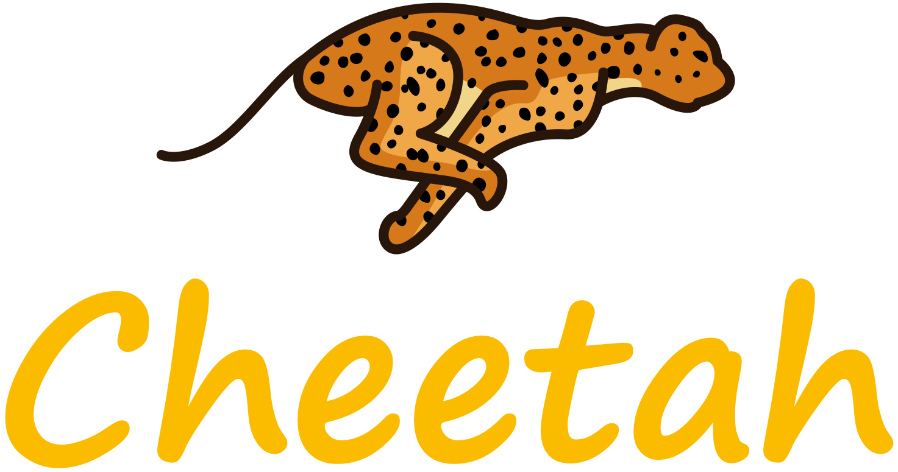
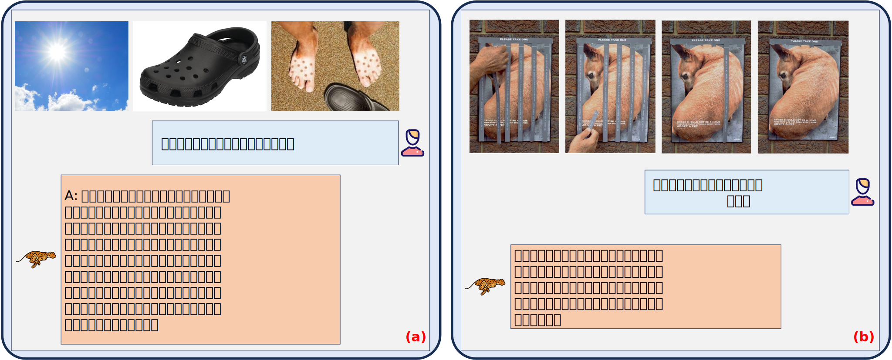

# 联觉-多模态大模型

## 项目简介

联觉是由浙江大学主导研发的跨媒体智能与推理项目，旨在“联接多重媒体信息，感知跨媒体语义”，从而高效构建跨媒体语义贯通的跨媒体智能。现已发布1.0版本多模态大模型-Cheetor，该模型能够根据指令内容有效感知复杂多模态指令中的关键视觉信息，并将其注入模型，从而实现对涉及多张关联图像的复杂多模态指令的联合推理。

## 示例

Cheetor展示出在涉及多张关联图像的复杂多模态指令上进行推理的强大能力。例如，在 **(a)** 中，Cheetor能够敏锐地识别图像之间的联系，从而推理出导致这一不寻常现象的原因。在 **(b, c)** 中，Cheetor可以推断出图像之间的关系，并理解它们想要传达的意图。在 **(e, f)** 中，Cheetor通过与人类进行多模式对话展示了理解荒谬对象的能力。

